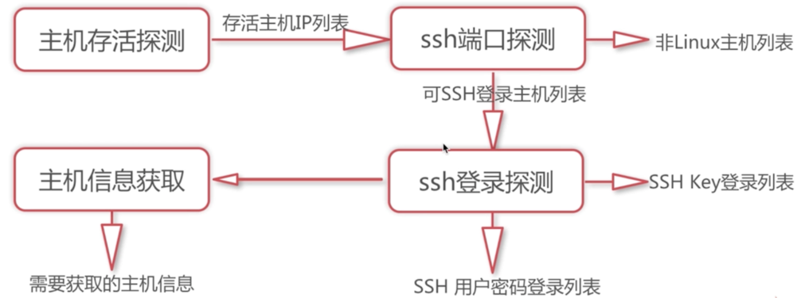
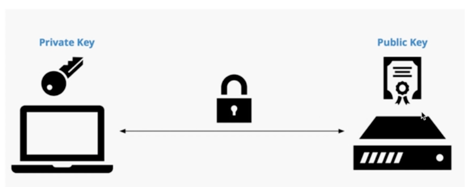
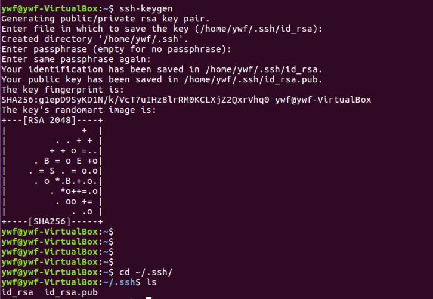
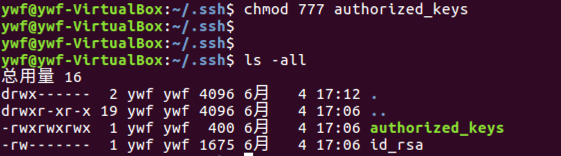
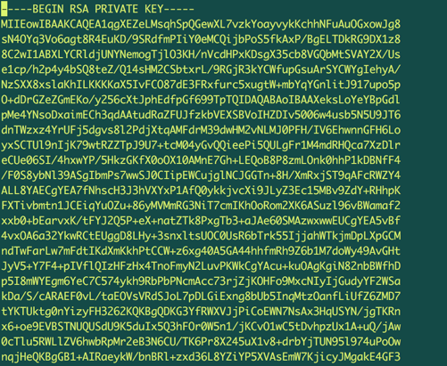

### 主机登录探测



### 什么是主机登录探测


> 用一系列的验证方式循环进行SSH登录，得到正确的登录方法。


### 登录验证的方法

* SSH密码：通过用户名和密码的方式验证

* SSH密钥:通过公钥和私钥的方法验证


### SSH的密钥登录原理



### 演示SSH公钥和私钥的登录机制

第一步：在目标服务器中，通过ssh-keygen命令生成公钥和私钥



第二步： 在目标服务器中，将.ssh目录中的公钥重命名以及修改权限

重命名


赋值权限



第三步：将目标服务器中的私钥文件替换到本地服务器(也就是连接目标服务器的客户端机器)的私钥文件中



第四步：在本地服务器终端，使用ssh命令登录目标主机。


### paramiko 模块实现ssh登录

> paramiko 基于python实现ssh远程安全连接，用于ssh远程执行命令，文件传输等功能的ssh客户端模块。


1-1. python环境下安装paramiko模块

```
 pip install paramiko
```

2-1. paramiko实现密码登录：

```
import paramiko
jssh = paramiko.SSHClient()
jssh.set_missing_host_key_policy(paramiko.AutoAddPolicy)
ret = jssh.connect('192.168.199.214', port=22, username='ywf', password='ywf')
print(ret)


```

3-1. paramiko RSA 密钥登录：

```
jssh = paramiko.SSHClient()

jssh.set_missing_host_key_policy(paramiko.AutoAddPolicy)
key = paramiko.RSAKey.from_private_key_file('id_rsa')
jssh.connect(hostname='192.168.199.214', port=22, username='ywf', pkey=key)
ret = jssh.exec_command('ls /tmp')
print(ret)


```
