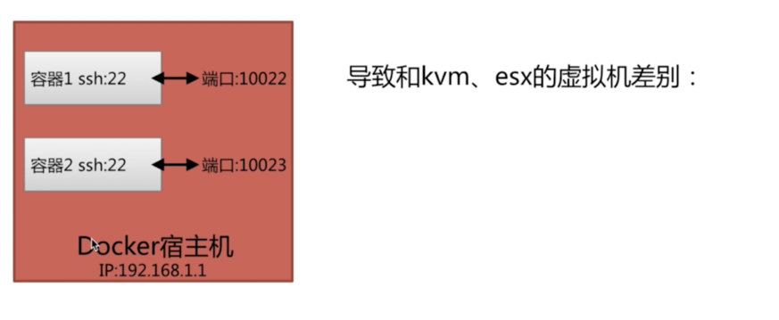
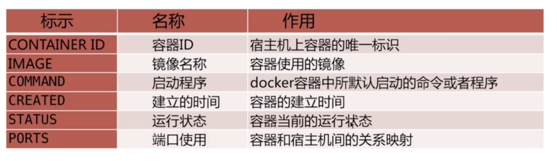
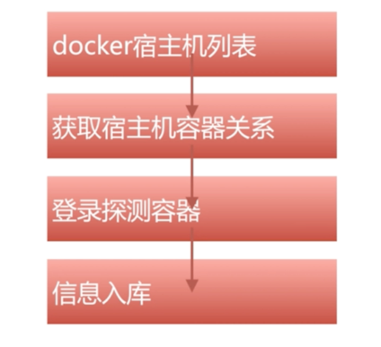

## docker容器的扫描

> 这里为什么对docker容器进行单独(特殊)扫描呢？这里和kvm ，esx 虚拟机的差别是什么？


### docker容器和kvm区别


> 1. docker和宿主机是共享ip地址
>
> 2. docker通过宿主机的端口映射来进行访问
>
> 3. kvm和esx 是独立的虚拟机
>
> 4. 宿主机可以有多个docker容器


### docker容器探测流程

- docker容器和宿主机的确认

  > 1. 通过宿主机获取唯一标识和ssh端口映射关系。
  >
  > 2. 通过命令：docker ps


- docker容器和宿主机关联关系



- docker容器和宿主机关联关系命令

```
docker ps | awk -F '->' '{print $1}' |grep -v 'CONTAINER' |awk 'BEGIN{FS~/s+/;}{print $NF" "$1" "$2";}' |sed s/0.0.0.0://

```

> 命令的解析：
>
> 1. awk -F '->' '{print $1}': 切换字符。将字符中出现的 `->`进行分隔成前后两份，$1:输出前第一份。 -F: 格式化字符
>
> 2. awk 'BEGIN{FS~/s+/;}: 正则表达式匹配空格符进行切割
>
> 3. sed s/0.0.0.0:// ： 去掉包含0.0.0.0: 的字符


### 批量docker容器扫描流程

 
