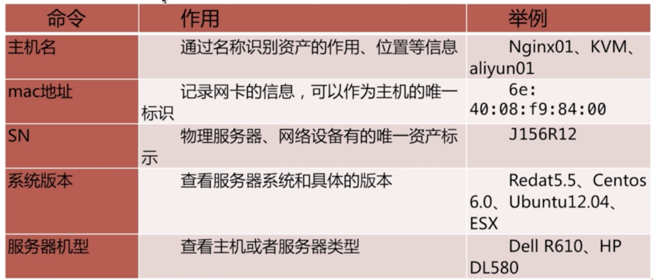
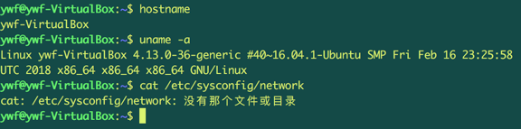
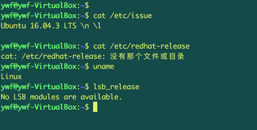
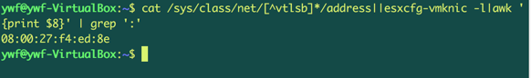
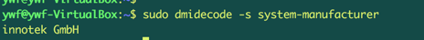

### 获取主机资产信息

> 当我们通过paramiko模块已经完成了自动化登录到主机中，那么接下来，可以通过paramiko模块中的exec_command()方法，执行相应的命令，来获取主机的信息。

但是，我们要获取主机哪些信息呢?

下面列表中，就是我们需要获取主机信息,视图列表：



> 为什么要获取这些信息呢？
> 1. 有利于识别资产设备
> 2. 是资产的基本信息，是自动化平台的基石
>

这里我们探测的主机类型为：非docker容器的类型的主机实体


### 获取系统主机名以及版本号

获取主机名：

> 获取主机名有多种方式，如下命令：


```
1. hostname

2. uname -a

3. cat /etc/sysconfig/network

```

演示：如图所示



### 获取系统版本号

获取系统版本号：

> 获取系统版本号有多种方式，如下命令：


```
1. cat /etc/issue

2. cat /etc/redhat-release

3. uname

4. lsb_release

```

演示：如图所示




> 注意： 不同的操作系统，执行相应的命令不一样，根据大家查询的系统，执行相应的命令就行了。

### 获取Mac地址信息

- 在linux系统中，我们采用以下命令来获取mac地址：

```
 1. cat /sys/class/net/eth0/address
 2. ifconfig eth0
 3. ip a

```

- 在ESXI系统中，我们采用以下命令：

```
 esxcfg-vmknic -l

```

为了兼容这两个系统，我们通常采用一个通用的复合命令：

```
  cat /sys/class/net/[^vtlsb]*/address||esxcfg-vmknic -l|awk '{print $8}' | grep ':'
```

`对以上的命令简答解析说明：`

- [^vtlsb]* ： 采用的正则表达式，匹配eth开头的mac地址信息。这里通过^取反操作，来排除vnet, lo,br0这些地址信息。

- awk ：对内容进行按列切割，只显示address一列。

演示：




### 获取服务器硬件机型

获取服务器硬件机型由以下命令来获取：

```
  1. dmidecode -s system-manufacturer
  2. dmidecode -s system-product-name
```

`注意事项：`

  - 如果在服务器中没有 `dmidecode`命令时，需要安装该命令。如：yum install dmidecode


演示：




### 获取服务器序列号

获取服务器序列号由以下命令来获取：

```
   dmidecode -s system-serial-number
```

演示：


