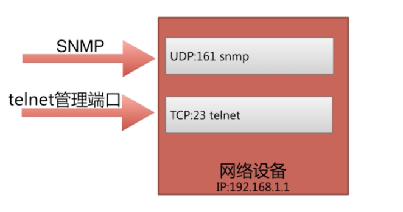
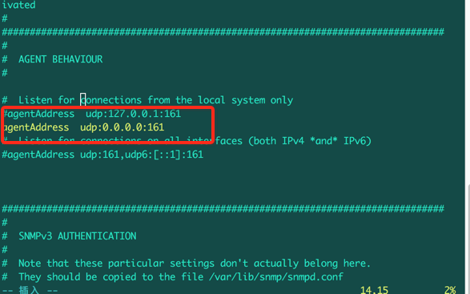

### 网络资产信息探测

> snmp 进行网络设备的扫描的主要模块




### 什么是snmp

> 简单网络管理协议，该协议能够支持网络关系系统，并获取相关信息


### 服务器安装配置

#### 安装过程

-  网络设备只需开启配置：`snmp-server enable traps`

-  服务器则需要安装snmp：

```
apt-get install snmpd snmp snmp-mibs-downloader

```

-  配置修改：/etc/snmp/目录下的snmpd.conf文件中的agentAddress属性

      

      > 将agentAddress udp:127.0.0.1:161 改为 agentAddress udp:0.0.0.0:161。 目的就是为了让其它服务器能够远程访问

- 重启snmpd服务

```
$ sudo /etc/init.d/snmpd restart
[ ok ] Restarting snmpd (via systemctl): snmpd.service.
```

#### 客户端snmpwalk命令验证

通过客户端snmpwalk命令，查询目标服务器的网络信息

```
snmpwalk -v 2c -c public 192.168.199.214
```

### 客户端安装snmp配置

#### 安装
- Centos 系统需要以下命令：

```
  yum install net-snmp-utils
```

- ubuntu 系统需要以下命令

```
  apt-get install snmp
```

- python 模块

```
  pip install pysnmp
```

#### snmpwalk命令使用

- snmpwalk命令，查询目标服务器的网络信息

```
 snmpwalk -v 2c -c public 192.168.199.214 iso.3.6.1.2.1.1.1.0
```

> 说明：iso.3.6.1.2.1.1.1.0: 该内容是，指定某个特定信息。


### python环境下使用snmp模块

```
from pysnmp.entity.rfc3413.oneliner import cmdgen

cg = cmdgen.CommandGenerator()
ret= cg.getCmd(
    # public： 密码
    # 0: 版本号
    cmdgen.CommunityData('snmpt', 'public', 0),
    # 161：是服务器端的snmp的端口
    cmdgen.UdpTransportTarget(transportAddr=('192.168.199.214', 161)),
    '1.3.6.1.2.1.1.1.0'
    )

print(ret)

```
