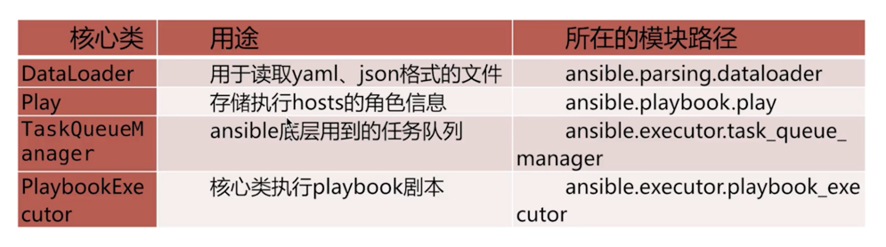
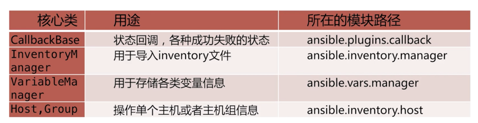
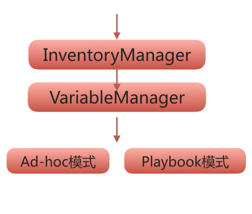
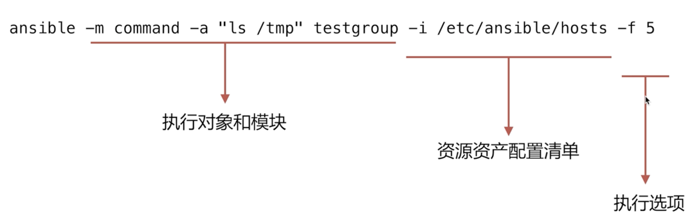
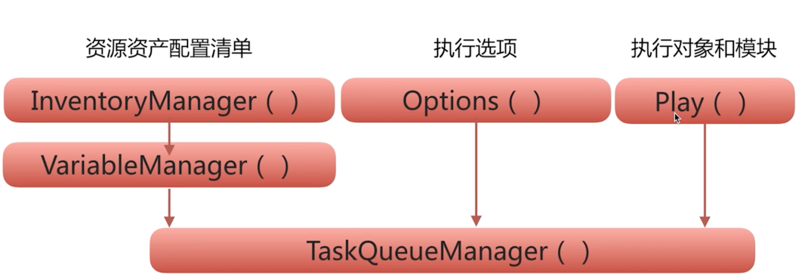
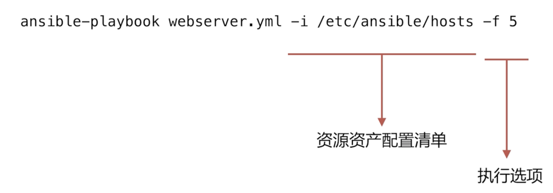
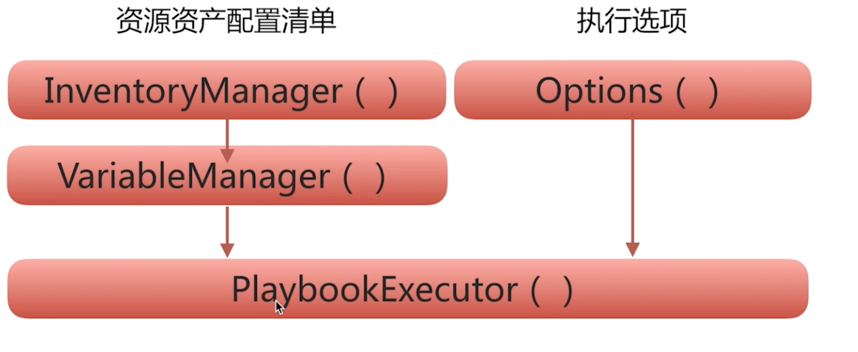
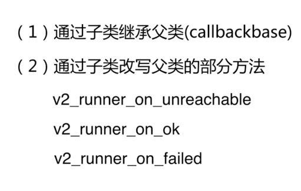

## ansible 核心类介绍

```
from ansible.parsing.dataloader import DataLoader
from ansible.vars.manager import VariableManager
from ansible.inventory.manager import InventoryManager
from ansible.playbook.play import Play
from ansible.executor.task_queue_manager import TaskQueueManager
from ansible.plugins.callback import CallbackBase

```






## ansible 实现自动化过程





## InventoryManager类

> InventoryManager: 用于管理主机和主机组资源设备细信息的

### InventoryManager调用过程

```
# 加载hosts配置文件的，加载器
loader = DataLoader()
# 读取hosts中的主机成员
# loader: 实例对象
# sources:传入资产配置文件路径
inventory = InventoryManager(loader = loader, sources= ['hosts',])
# 获取hosts中的主机成员
groups = inventory.get_groups_dict()
print(groups)
```

### InventoryManager相关方法

`add_host():` 添加主机到指定主机组


      loader = DataLoader()
      inventory = InventoryManager(loader = loader, sources= ['hosts',])
      inventory.add_host(host='192.168.199.214', group='group2', port=22)

`get_groups_dict():` 查看主机组资源

      loader = DataLoader()
      inventory = InventoryManager(loader = loader, sources= ['hosts',])
      inventory.get_groups_dict()

`get_hosts():` 获取指定的主机对象

      loader = DataLoader()
      inventory = InventoryManager(loader = loader, sources= ['hosts',])
      inventory.get_hosts()


## InventoryManager类

```
loader = DataLoader()
inventory = InventoryManager(loader = loader, sources= ['hosts',])
variable  = VariableManager(loader = loader, inventory=inventory)

# 查看变量方法
variable.get_vars(host='192.168.199.214')
# 设置主机变量方法
variable.set_host_variable(host='192.168.199.214', varname='ansible_ssh_pass', value='12345')
# 添加扩展变量
variable.extra_vars = {'var': 'value', 'var1':'value'}
```

## ad-hoc模式调用

### ad-hoc通过命令的调用回顾




### ad-hoc模式通过类的调用流程




### 实例演示

```
Options = namedtuple('Options', ['connection', 'module_path',
                                 'forks', 'timeout', 'remote_user',
                                 'ask_pass', 'private_key_file',
                                 'ssh_common_args', 'ssh_extra_args',
                                 'sftp_extra_args',
                                 'scp_extra_args', 'become',
                                 'become_method', 'become_user',
                                 'ask_value_pass',
                                 'verbosity',
                                 'check', 'listhosts',
                                 'listtasks', 'listtags',
                                 'syntax', 'diff'])

options = Options(
    connection='smart',
    module_path=None,
    timeout=10,
    remote_user=None,
    ask_pass=None,
    private_key_file=None,
    ssh_common_args=None,
    ssh_extra_args=None, sftp_extra_args=None,
    scp_extra_args=None, become=None, become_method=None,
    become_user=None, ask_value_pass=None, verbosity=None, check=None,
    listhosts=None, listtasks=None, listtags=None, syntax=None, diff=None
)

ad_hoc_source = dict(
    name="Ansible ad-hoc",
    hosts=['192.168.199.214'],  # 目标主机的host
    gather_facts='no',  # 关闭在执行命令前，获取系统的环境信息
    tasks=[dict(action=dict(module='shell', args='touch /tmp/ad_hoc_test1'))]
)
loader = DataLoader()
inventory = InventoryManager(loader=loader, sources=['hosts', ])
variable = VariableManager(loader=loader, inventory=inventory)
taskQueueManager = TaskQueueManager(inventory=inventory,
                                    variable_manager=variable,
                                    loader=loader,
                                    options=options,
                                    stdout_callback=None
                                    )
play = Play().load(data=ad_hoc_source, variable_manager=variable, loader=loader)
taskQueueManager.run(play=play)

```


## playbook模式调用

### playbook 通过命令调用过程



### playbook模式通过类的




### 实例演练

```
Options = namedtuple('Options', ['connection', 'module_path',
                                 'forks', 'timeout', 'remote_user',
                                 'ask_pass', 'private_key_file',
                                 'ssh_common_args', 'ssh_extra_args',
                                 'sftp_extra_args',
                                 'scp_extra_args', 'become',
                                 'become_method', 'become_user',
                                 'ask_value_pass',
                                 'verbosity',
                                 'check', 'listhosts',
                                 'listtasks', 'listtags',
                                 'syntax', 'diff'])

options = Options(
    connection='smart',
    module_path=None,
    timeout=10,
    remote_user=None,
    ask_pass=None,
    private_key_file=None,
    ssh_common_args=None,
    ssh_extra_args=None, sftp_extra_args=None,
    scp_extra_args=None, become=None, become_method=None,
    become_user=None, ask_value_pass=None, verbosity=None, check=None,
    listhosts=None, listtasks=None, listtags=None, syntax=None, diff=None
)

ad_hoc_source = dict(
    name="Ansible ad-hoc",
    hosts=['192.168.199.214'],  # 目标主机的host
    gather_facts='no',  # 关闭在执行命令前，获取系统的环境信息
    tasks=[dict(action=dict(module='shell', args='touch /tmp/ad_hoc_test1'))]
)
loader = DataLoader()
inventory = InventoryManager(loader=loader, sources=['hosts', ])
variable = VariableManager(loader=loader, inventory=inventory)
playbookExecutor = PlaybookExecutor(playbooks=['f1.yml'],
                                    inventory=inventory,
                                    variable_manager=variable,
                                    loader=loader,
                                    options=options,
                                    stdout_callback=None,
                                    passwords={}
                                    )
play = Play().load(data=ad_hoc_source, variable_manager=variable, loader=loader)
playbookExecutor.run(play=play)

```


## CallbackBase 类方法改写

> CallbackBase类的作用就是任务执行完成以后，通过CallbackBase类获取执行结果内容


### CallbackBase类改写的过程



### 实例演练

```
class ModelResultsCollector(CallbackBase):

    def __init__(self, *args, **kwargs):
        super(ModelResultsCollector, self).__init__(*args, **kwargs)
        self.host_ok = {}
        self.host_unreachable = {}
        self.host_failed = {}

    def v2_runner_on_unreachable(self, result):
        self.host_unreachable[result._host.get_name()] = result

    def v2_runner_on_ok(self, result,  *args, **kwargs):
        self.host_ok[result._host.get_name()] = result


    def v2_runner_on_failed(self, result,  *args, **kwargs):
        self.host_failed[result._host.get_name()] = result

```


### ad-hoc的CallbackBase

#### CallbackBase 类的改写

```
class ModelResultsCollector(CallbackBase):

    def __init__(self, *args, **kwargs):
        super(ModelResultsCollector, self).__init__(*args, **kwargs)
        self.host_ok = {}
        self.host_unreachable = {}
        self.host_failed = {}

    def v2_runner_on_unreachable(self, result):
        self.host_unreachable[result._host.get_name()] = result

    def v2_runner_on_ok(self, result,  *args, **kwargs):
        self.host_ok[result._host.get_name()] = result


    def v2_runner_on_failed(self, result,  *args, **kwargs):
        self.host_failed[result._host.get_name()] = result
```

#### CallbackBase应用

```
self.callback = ModelResultsCollector()
        import traceback
        try:
            tqm = TaskQueueManager(
                    inventory=self.inventory,
                    variable_manager=self.variable_manager,
                    loader=self.loader,
                    options=self.options,
                    passwords=self.passwords,
                    stdout_callback = "minimal",
            )
            tqm._stdout_callback = self.callback

```

### playbook的CallbackBase

#### CallbackBase 类的改写

```
class PlayBookResultsCollector(CallbackBase):
    CALLBACK_VERSION = 2.0
    def __init__(self, *args, **kwargs):
        super(PlayBookResultsCollector, self).__init__(*args, **kwargs)
        self.task_ok = {}
        self.task_skipped = {}
        self.task_failed = {}
        self.task_status = {}
        self.task_unreachable = {}

    def v2_runner_on_ok(self, result, *args, **kwargs):
        self.task_ok[result._host.get_name()]  = result

    def v2_runner_on_failed(self, result, *args, **kwargs):
        self.task_failed[result._host.get_name()] = result

    def v2_runner_on_unreachable(self, result):
        self.task_unreachable[result._host.get_name()] = result

    def v2_runner_on_skipped(self, result):
        self.task_ok[result._host.get_name()]  = result

    def v2_playbook_on_stats(self, stats):
        hosts = sorted(stats.processed.keys())
        for h in hosts:
            t = stats.summarize(h)
            self.task_status[h] = {
                                       "ok":t['ok'],
                                       "changed" : t['changed'],
                                       "unreachable":t['unreachable'],
                                       "skipped":t['skipped'],
                                       "failed":t['failures']
                                   }

```

#### CallbackBase应用

```
self.callback = PlayBookResultsCollector()

executor = PlaybookExecutor(
          playbooks=[playbook_path],
          inventory=self.inventory, variable_manager=self.variable_manager,
          loader=self.loader,
          options=self.options,
          passwords=self.passwords,
           )
executor._tqm._stdout_callback = self.callback

```
