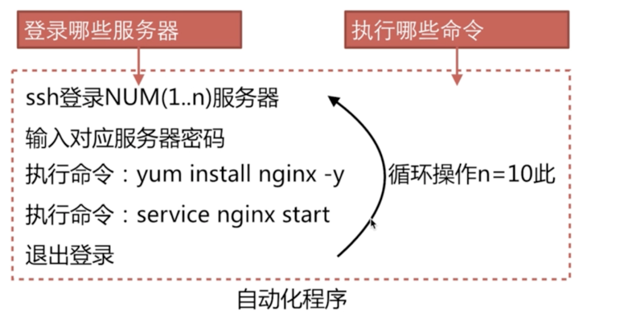
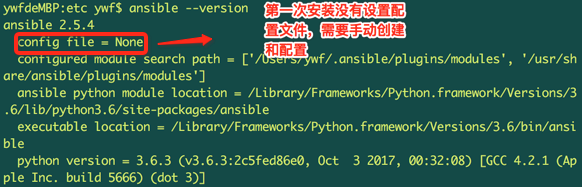

## 1. 什么是自动化任务




## 2. 自动化任务的意义


## 3. 自动化任务应用


## 4. ansible基础和安装

### 4-1: 什么是ansible

> ansible 是python中的一套模块，系统中的一套自动化工具，
> 可以用来做系统管理，自动化命令等任务。

### 4-2: ansible的优势

- ansible是python中的一套完整的自动化执行任务模块
- ansible的play_book模式，采用yaml配置，对于自动化任务执行一目了然
- 自动化场景支持丰富

### 4-3: ansible的安装

1. 通过系统方式安装：yum ,apt-get等
2. 通过python方法：

  >
  >2-1：python ./setup.py install
  >
  >2-2: easy_install ansible
  >
  >2-3: pip install ansible

## 5. ansible.cfg配置

> ansible 安装成功以后，我们可以 ansible --version 版本信息。





> 第一次安装ansible时，并没有配置ansible.cfg文件，需要开发人员手动创建
> ansible.cfg文件以及设置路径

### 5-1：ansible.cfg 和 hosts 文件的配置

- 在系统的/etc/目录下创建ansible文件夹，并在ansible文件夹下，创建ansible.cfg文件

```
    mkdir -p /etc/ansible/
    sudo vim /etc/ansible/ansible.cfg
```
在ansible.cfg文件中输入一下内容:

```
[defaults]
inventory = /etc/ansible/hosts
[ssh_connection]

```

- 在/etc/ansible/目录下创建hosts文件

```
    sudo vim /etc/ansible/hosts
```
hosts文件中输入一下内容：

```
[test]
192.168.199.214 ansible_ssh_user=ywf ansible_ssh_pass='ywf'

```

### 5-2：将配置的ansible.cfg文件导入到环境变量中

```
export ANSIBLE_CONFIG=/etc/ansible/ansible.cfg

```
此时，再查看ansible的信息时， 就会出现配置的路径以及文件。


### 5-3：ansible.cfg 和 hosts 文件的作用

> ansible.cfg: 自动化执行任务相关配置
>
> hosts: 执行任务的目标服务器的登录信息相关配置
