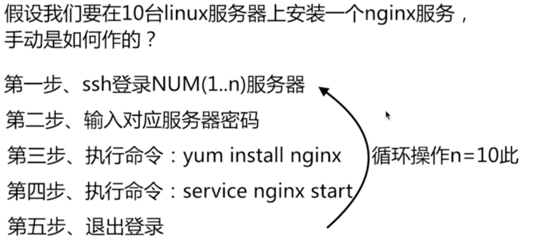

## 1. 什么是自动化任务




## 2. 自动化任务的意义


## 3. 自动化任务应用


## 4. ansible基础和安装

### 4-1: 什么是ansible

> ansible 是python中的一套模块，系统中的一套自动化工具，
> 可以用来做系统管理，自动化命令等任务。

### 4-2: ansible的优势

- ansible是python中的一套完整的自动化执行任务模块
- ansible的play_book模式，采用yaml配置，对于自动化任务执行一目了然
- 自动化场景支持丰富

### 4-3: ansible的安装

1. 通过系统方式安装：yum ,apt-get等
2. 通过python方法：

  >
  >2-1：python ./setup.py install
  >
  >2-2: easy_install ansible
  >
  >2-3: pip install ansible

## 5. ansible.cfg配置

> ansible 安装成功以后，我们可以 ansible --version 版本信息。


> 第一次安装ansible时，并没有配置ansible.cfg文件，需要开发人员手动创建
> ansible.cfg文件以及设置路径

### 5-1：ansible.cfg 和 hosts 文件的配置

- 在系统的/etc/目录下创建ansible文件夹，并在ansible文件夹下，创建ansible.cfg文件

```
    mkdir -p /etc/ansible/
    sudo vim /etc/ansible/ansible.cfg
```
在ansible.cfg文件中输入一下内容:

```
[defaults]
inventory = /etc/ansible/hosts
[ssh_connection]

```

- 在/etc/ansible/目录下创建hosts文件

```
    sudo vim /etc/ansible/hosts
```
hosts文件中输入一下内容：

```
[test]
192.168.199.214 ansible_ssh_user=ywf ansible_ssh_pass='ywf'

```

### 5-2：将配置的ansible.cfg文件导入到环境变量中

```
export ANSIBLE_CONFIG=/etc/ansible/ansible.cfg

```
此时，再查看ansible的信息时， 就会出现配置的路径以及文件。


### 5-3：ansible.cfg 和 hosts 文件的作用

> ansible.cfg: 自动化执行任务相关配置
>
> hosts: 执行任务的目标服务器的登录信息相关配置


### 5-4：ansible.cfig 常见配置项说明

> Ansible.cfg是ansible自动化任务所用的一个核心配置文件，
大部分的配置文件都集中在defualts配置项目中。

```
1）inventory
该参数表示资源清单inventory文件的位置，资源清单就是一些Ansible需要连接管理的主机列表
inventory = /root/ansible/hosts

2）library
Ansible的操作动作，无论是本地或远程，都使用一小段代码来执行，这小段代码称为模块，
这个library参数就是指向存放Ansible模块的目录 library = /usr/share/ansible

3）forks
设置默认情况下Ansible最多能有多少个进程同时工作，默认设置最多5个进程并行处理。
具体需要设置多少个，可以根据控制主机的性能和被管理节点的数量来确定。 forks = 5

4）sudo_user
这是设置默认执行命令的用户，也可以在playbook中重新设置这个参数
sudo_user = root //注意:新版本已经作了修改，
如ansible2.4.1下已经为： default_sudo_user = root

5）remote_port
这是指定连接被关节点的管理端口，默认是22，除非设置了特殊的SSH端口，
不然这个参数一般是不需要修改的 remote_port = 22

6）host_key_checking
这是设置是否检查SSH主机的密钥。可以设置为True或False
host_key_checking = False

7）timeout
这是设置SSH连接的超时间隔，单位是秒。 timeout = 20

8）log_path
Ansible系统默认是不记录日志的，如果想把Ansible系统的输出记录到人i治稳健中，
需要设置log_path来指定一个存储Ansible日志的文件
log_path = /var/log/ansible.log


9）private_key_file
在使用ssh公钥私钥登录系统时候，使用的密钥路径。
private_key_file=/path/to/file.pem

```

### 5-5: hosts文件常见的配置说明

hosts文件常见的配置方式：

```
[group_name_1]
# ssh用户 + ssh 密码
192.168.199.214 ansible_ssh_user=ywf ansible_ssh_pass='ywf'

[group_name_2]
# ssh用户+ssh密钥
192.168.199.214 ansible_ssh_user=ywf
ansible_ssh_private_key_file='/Users/fly/.ssh/id_rsa'

[group_name_3]
# 别名 + ssh用户+ssh密钥
test1 ansible_ssh_host=192.168.199.214 ansible_ssh_port=22
ansible_ssh_user=ywf ansible_ssh_private_key_file='/Users/fly/.ssh/id_rsa'

```

实例演示：

```
[test_group1]
192.168.199.214 ansible_ssh_user=ywf ansible_ssh_pass='ywf'
192.168.199.214 ansible_ssh_user=ywf ansible_ssh_pass='ywf'
192.168.199.214 ansible_ssh_user=ywf ansible_ssh_pass='ywf'

[test_group2]
192.168.199.214 ansible_ssh_user=ywf ansible_ssh_pass='ywf'

```
通过ansible命令，查看hosts配置清单

```
# 查询所有分组配置信息
ansible all --list-hosts

# 指定组名配置信息
ansible test_group1 --list-hosts
```
