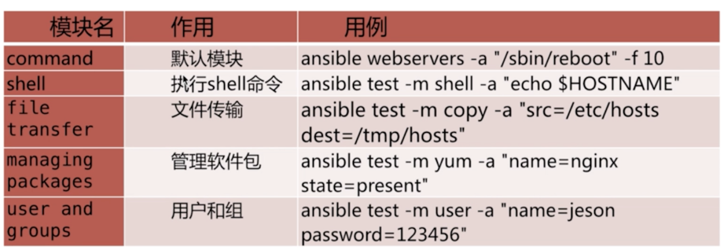
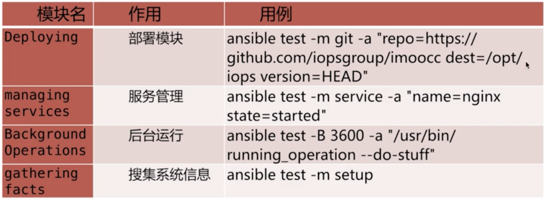

## 什么是ad-hoc模式

> ad-hoc简而言之，就是 ‘临时命令’. 执行简单，时间断的任务。

## ad-hoc模式的使用场景

> 在多台机器上，查看某个进程是否启动
>
> 在多台机器上，拷贝指定日志文件的本地

## ad-hoc模式的命令使用

#### ad-hoc模式命令格式

```
ansible <host-pattern> [options]

host-pattern: 匹配主机名或者主机组名
options: 包括执行的模块和执行的命令参数
比如：

ansible 192.168.199.* -a 'ls /tmp'
ansible group1 -a 'ls /tmp'
ansible test1 -a 'ls /tmp'

```

#### ad-hoc模式命令参数介绍

> 针对 ansible <host-pattern> [options] 命令中的options选项参数说明和介绍：

|参数|说明|
|:-|:-|
|-v, --verbose|输出更详细的执行过程信息，-vvv可得到所有执行过程信息|
|-i PATH, --inventory=PATH|指定inventory信息，默认/etc/ansible/hosts。|
|-f NUM, --forks=NUM|并发线程数，默认5个线程。|
|--private-key=PRIVATE_KEY_FILE|指定密钥文件。|
|-m NAME, --module-name=NAME：|指定执行使用的模块。|
|-M DIRECTORY, --module-path=DIRECTORY：|指定模块存放路径，默认/usr/share/ansible，也可以通过ANSIBLE_LIBRARY设定默认路径。|
|-a 'ARGUMENTS', --args='ARGUMENTS'：|模块参数。|
|-k, --ask-pass SSH：|认证密码。|
|-K, --ask-sudo-pass sudo：|用户的密码（—sudo时使用）。|
|-o, --one-line：|标准输出至一行。|
|-s, --sudo：|相当于Linux系统下的sudo命令。|
|-t DIRECTORY, --tree=DIRECTORY：|输出信息至DIRECTORY目录下，结果文件以远程主机名命名。|
|-T SECONDS, --timeout=SECONDS：|指定连接远程主机的最大超时，单位是：秒。|
|-B NUM, --background=NUM：|后台执行命令，超NUM秒后kill正在执行的任务。|
|-P NUM, --poll=NUM：|定期返回后台任务进度。|
|-u USERNAME, --user=USERNAME：|指定远程主机以USERNAME运行命令。|
|-U SUDO_USERNAME, --sudo-user=SUDO_USERNAM：| 使用sudo，相当于Linux下的sudo命令。|
|-c CONNECTION, --connection=CONNECTION：|指定连接方式，可用选项paramiko (SSH), ssh, local。Local方式常用于crontab 和 kickstarts。|
|-l SUBSET, --limit=SUBSET：|指定运行主机。|
|-l ~REGEX, --limit=~REGEX：|指定运行主机（正则）。|
|--list-hosts| 列出符合条件的主机列表，不执行任何其他命令|

## ad-hoc模式常用模块




## 场景演示

```
ansible all -m shell -a 'echo $HOSTNAME'

ansible all -m copy -a 'src=/etc/hosts dest=/tmp' -f 5 -l 192.168.199.214

ansible all -m setup

ansible all -m setup -a 'filter=ansible_distribution*'

ansible all -m yum -a 'name=nginx state=removed'

ansible all -m git -a 'repo=https://github.com/hightfly01/test dest=/opt/test' -f 5
```
