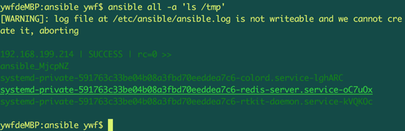

## ssh 密码登录

- 安装ssh-pass模块

系统环境下，安装ssh-pass模块

```
 ubuntu: apt-get install sshpass

 centos: yum install sshpass

```

- 配置ansible.cfg文件

```
[defaults]
inventory = /etc/ansible/hosts
forks = 5
default_sudo_user = ywf
remote_port = 22
host_key_checking = False
timeout = 20
log_path = /etc/ansible/ansible.log
#private_key_file=/etc/ansible/file.pem

```

- 配置hosts文件：添加需要登录到目标服务器的成员

```
[test_group1]
192.168.199.214 ansible_ssh_user=ywf ansible_ssh_pass='ywf'
192.168.199.214 ansible_ssh_user=ywf ansible_ssh_pass='ywf'
192.168.199.214 ansible_ssh_user=ywf ansible_ssh_pass='ywf'

[test_group2]
192.168.199.214 ansible_ssh_user=ywf ansible_ssh_pass='ywf'

```


- 自动化执行任务

```
ansible all -a 'ls /tmp'

```


## ssh 密钥登录

- 在本机客户端生成公钥和私钥并拷贝公钥到目标服务器中

```
# 生成公钥和私钥
ssh-keygen
# 拷贝公钥到目标服务器中。
ssh-copy-id 192.168.199.214
```

- 修改hosts文件配置

```
[test_group1]
192.168.199.214 ansible_ssh_user=ywf
ansible_ssh_private_key_file='/Users/fly/.ssh/id_rsa'
```

- 自动化执行任务

```
# 批量自动化执行任务
ansible all -a 'ls /tmp'

# 指定某一组成员，自动化执行任务
ansible test_group1 -a 'ls /tmp'
```
实例演示：


