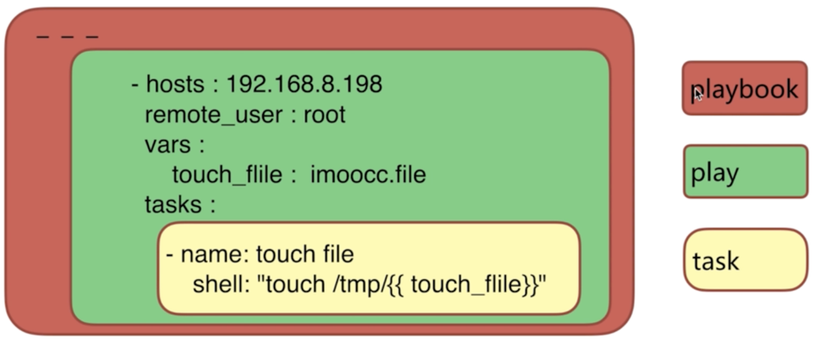
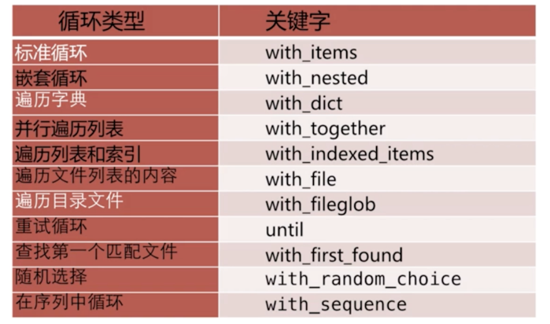
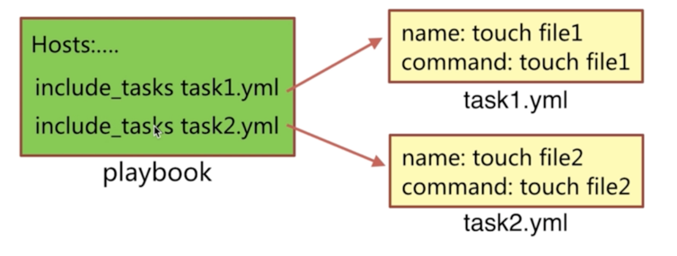
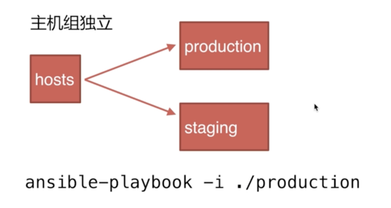

## 什么是playbook及组成

### 定义

> playbook: 翻译过来就是‘剧本’

### 组成

> play： 定义的是主机的角色
>
> task: 定义的是具体执行的任务
>
> playbook： 有一个或者多个play组成，一个play可以包含多个task



## playbook的优势

> 功能比adhoc模式更全
>
> 控制好依赖
>
> 展示更直观
>
> 持久使用


## playbook的配置语法


### 1. 基本使用（执行命令）

执行命令方式:

> ansible-playbook playbook.yml [options]

options参数说明：

|参数|说明|
|:-|:-|
|-u REMOTE_USER, --user=REMOTE_USER| ssh 连接的用户名|
|-k, --ask-pass   |ssh登录认证密码   |
|-s, --sudo| ＃sudo 到root用户，相当于Linux系统下的sudo命令 -U SUDO_USER, --sudo-user=SUDO_USER ＃sudo 到对应的用户|
|-K, --ask-sudo-pass| ＃用户的密码（—sudo时使用）|
|-T TIMEOUT, --timeout=TIMEOUT| ＃ ssh 连接超时，默认 10 秒|
|-C, --check| ＃ 指定该参数后，执行 playbook 文件不会真正去执行，而是模拟执行一遍，然后输出本次执行会对远程主机造成的修改|
|-e EXTRA_VARS, --extra-vars=EXTRA_VARS| ＃ 设置额外的变量如：key=value 形式 或者 YAML or JSON，以空格分隔变量，或用多个-e|
|-f FORKS, --forks=FORKS |＃ 进程并发处理，默认 5|
|-i INVENTORY, --inventory-file=INVENTORY| ＃ 指定 hosts 文件路径，默认 default=/etc/ansible/hosts|
|-l SUBSET, --limit=SUBSET |＃ 指定一个 pattern，对- hosts:匹配到的主机再过滤一次|
|--list-hosts |＃ 只打印有哪些主机会执行这个 playbook 文件，不是实际执行该 playbook|
|--list-tasks| ＃ 列出该 playbook 中会被执行的 task|
|--private-key=PRIVATE_KEY_FILE| ＃ 私钥路径|
|--step |＃ 同一时间只执行一个 task，每个 task 执行前都会提示确认一遍|
|--syntax-check |＃ 只检测 playbook 文件语法是否有问题，不会执行该 playbook|
|-t TAGS, --tags=TAGS |＃当 play 和 task 的 tag 为该参数指定的值时才执行，多个 tag 以逗号分隔|
|--skip-tags=SKIP_TAGS |＃ 当 play 和 task 的 tag 不匹配该参数指定的值时，才执行 |
|-v, --verbose |＃输出更详细的执行过程信息，-vvv可得到所有执行过程信息。|


### 2.剧本中yaml文件配置和执行

#### yaml文件配置：

```
---
- hosts : 192.168.199.214
  remote_user : ywf
  vars :
     touch_file : test.file
  tasks :
      - name : touch file
        shell : 'touch /tmp/{{touch_file}}'
```

#### playbook执行：

```
ansible-playbook -i /etc/ansible/hosts --list-hosts ./f1.yml

ansible-playbook ./f1.yml


```

## 剧本中变量的定义

### 1. yaml文件中定义变量赋值


```
---
- hosts : 192.168.199.214
  remote_user : ywf
  vars : # 文件中通过vars定义变量
     touch_file : test.file
  tasks :
      - name : touch file
        shell : 'touch /tmp/{{touch_file}}'
```

### 2. --extra-vars执行参数赋值给变量


```
 ansible-playbook ./f1.yml --extra-vars 'touch_file=jeson2'
```

### 3. 注册变量

> register 关键字可以存储指定命令的输出结果到一个自定义的变量中

格式：

```

- name: get time
  command: date  # 通过date输出时间
  register: date_output  # 通过register来获取并记录date输出的时间
```

案例演示：

剧本的配置：

```
---
- hosts : 192.168.199.214
  remote_user : ywf
  vars :
     touch_file : imoocc.file
  tasks :
      - name : get date
        command : date
        register : date_output
      - name : touch file
        shell : 'touch /tmp/{{touch_file}}'
      - name : echo date_output
        shell : 'echo {{date_output.stdout}} > /tmp/{{touch_file}}'

```

剧本执行：

```
ansible-playbook ./f2.yml
```

## 剧本中条件判断

> 条件判断语句 `when` 语句

使用演练：

```
- hosts : 192.168.199.214
  remote_user : ywf
  vars :
     touch_file : id_rsa
  tasks :
      - name : touch flag  file
        command : 'touch /tmp/this_is_{{ansible_distribution}}_system'
        when : ansible_distribution == 'CentOS'

```

## 剧本中循环语句

### 循环语句类型分类



### 标准循环

```
- hosts : 192.168.199.214
  remote_user : ywf
  tasks :
      - name: add serveral users
        user: name={{ item.name }} state=present groups={{ item.groups }}
        with_items:
            - { name: 'testuser1', groups: 'ywf' }
            - { name: 'testuser2', groups: 'ywf' }


```
### 遍历字典

```
- hosts : 192.168.199.214
  remote_user : ywf
  tasks :
      - name: add serveral users
        user: name={{ item.key }} state=present groups={{ item.value }}
        with_items:
            - { 'testuser3': 'wheel', 'testuser4' : 'wheel'}


```
### 遍历目录文件

```
- hosts : 192.168.199.214
  remote_user : ywf
  tasks :
      - name: copy files
        copy: src={{ item }} dest=/tmp/bb owner=ywf mode=600
        with_fileglob:
          - aa/*

```

## 剧本中条件和循环结合语句

```
- hosts : 192.168.199.214
  remote_user : ywf
  tasks :
      - name: winner
        debug: msg='{{item.key}} is the winner {{item.value}}'
        with_dict:
            - {'test': {'englist' : 60}}
            - {'test1': {'englist' : 80}}

        when : item.value.englist > 60


```

## 剧本中异常处理

### 忽略错误

```
- hosts : 192.168.199.214
  remote_user : ywf
  tasks :
      - name: ignore false
        command: /bin/false
        ignore_errors: yes # 忽略错误，进行往下执行

```

### 自定义错误

```
- hosts : 192.168.199.214
  remote_user : ywf
  vars:
  tasks :
      - name: get process
        shell: ps -ef|wc -l
        register: process_count
        failed_when: "'FAILED' in process_count > 3"
      - name: echo errors
        debug: msg='{{ process_count }}'


```

## 剧本中include用法

> include 用法：
>
> include_tasks/include:动态的包含tasks任务列表执行




```
- hosts : 192.168.199.214
  remote_user : ywf
  vars:
  tasks :
     - include_tasks: touchf1.yml
     - include_tasks: touchf2.yml

```

## 定义roles剧本

### 什么是roles

> 是一种利用在大型playbook中的剧本配置模式，有这自己特定结构

### 为什么需要用到roles

> 和面向对象开发思想相似
>
> 利用大型的项目任务中，尽可能的将公共的任务，变量等内容独立
>

### 剧本roles 设计思路

ansible


### 官方网站的建议roles剧本结构如下：

```

production # 正式环境的inventory文件
staging #测试环境用得inventory文件
group_vars/ # 机器组的变量文件
     group1
     group2
host_vars/ #执行机器成员的变量
     hostname1
     hostname2

webservers.yml

roles/
    webservers/
          tasks/
              main.yml
          handlers/
              main.yml
          vars/
              main.yml
    common/
        tasks/
           main.yml
        handlers/
           main.yml
        vars/
            main.yml

```

## roles演示部署服务(nginx)
